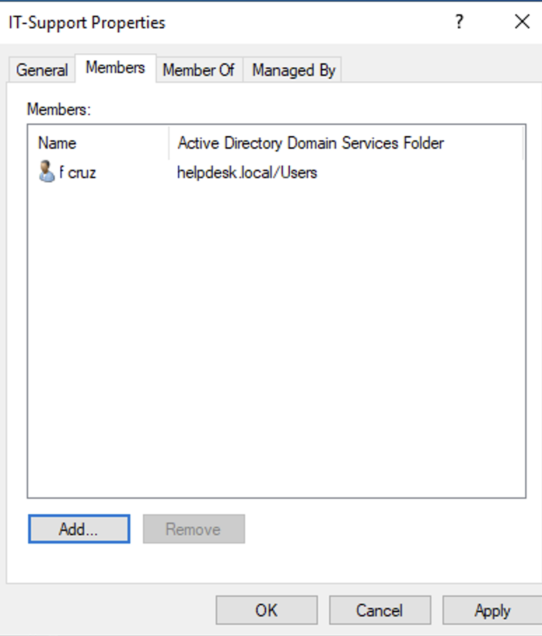

# Azure Lab – Active Directory Domain User Management

## Objective
Simulate common Help Desk tasks involving user account management within an Active Directory environment.

## Environment
- Microsoft Azure Virtual Machine
- Windows Server 2022 Datacenter
- Active Directory Domain Services installed
- Domain: helpdesk.local

---

# Organizational Structure

Two Organizational Units (OUs) were created to organize users and security groups.

CorporateUsers
SecurityGroups

This structure allows administrators to apply policies and permissions more efficiently.

---

# Domain Users Created

The following users were created inside the CorporateUsers OU:

| Name | Username | Role |
|-----|-----|-----|
| IT Admin | tadmin | Accounting |
| Maria Lopez | mlopez | Accounting |
| Fidel Cruz | fcruz | IT Support |

Each account was configured with a temporary password and standard user privileges.

---

# Security Groups Created

Two security groups were created inside the SecurityGroups OU.

| Group Name | Purpose |
|-----|-----|
| IT-Support | Administrative IT staff |
| Accounting | Accounting department users |

---

# Group Membership Configuration

Users were assigned to groups according to role.

| User | Group |
|-----|-----|
| fcruz | IT-Support |
| tadmin | Accounting |
| mlopez | Accounting |

This demonstrates **role-based access control (RBAC)** commonly used in enterprise environments.

---

# Simulated Help Desk Tasks

The following common administrative tasks were performed:

### Password Reset
Reset password for user:

fcruz

### Account Disable
User account temporarily disabled to simulate security investigation.

### Account Re-enable
Account reactivated after verification.

These tasks represent standard help desk identity management responsibilities.

---

# Verification

Administrative tasks were verified through the Active Directory Users and Computers console.

Users successfully authenticated and group memberships were confirmed.

---

# Skills Demonstrated

- Active Directory user management
- Organizational Unit structure
- Security group configuration
- Role-based access control
- Password reset procedures
- Account lifecycle management
