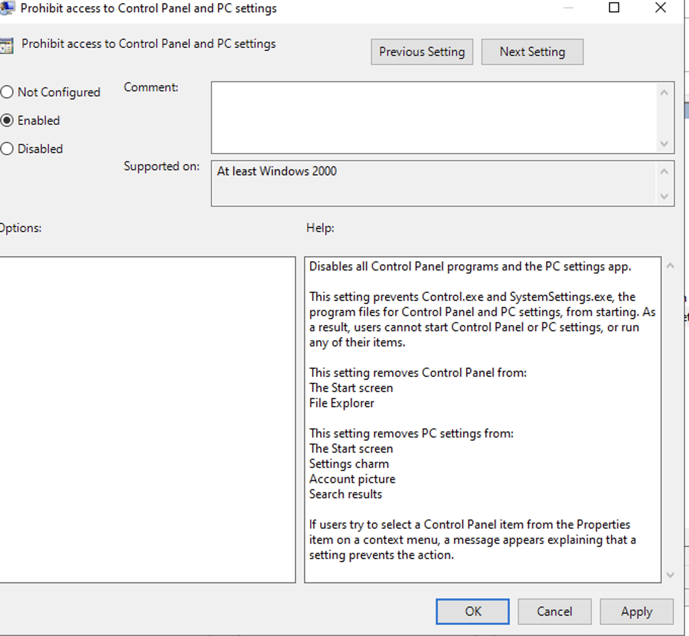
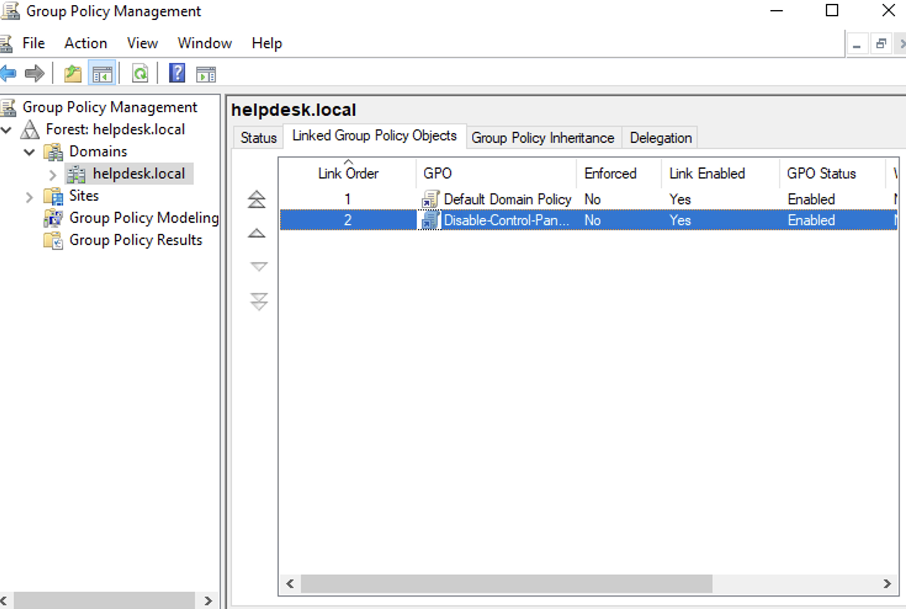

# Azure Lab – Group Policy Implementation

## Objective
Demonstrate centralized policy management using Group Policy in an Active Directory environment.

## Environment
- Microsoft Azure Virtual Machine
- Windows Server 2022 Datacenter
- Active Directory Domain Services installed
- Domain: helpdesk.local
- Management tool: Group Policy Management Console (GPMC)

---

## Overview
Group Policy allows administrators to control user and computer settings across a domain environment. In this lab, a policy was created to restrict user access to the Windows Control Panel.

This simulates a real-world scenario where organizations restrict system settings to maintain security and standardization.

---

## Steps Performed

### 1. Opened Group Policy Management
Accessed the Group Policy Management Console through:

Server Manager → Tools → Group Policy Management

---

### 2. Created a New Group Policy Object (GPO)

Inside the domain:

fidel.local

Created a new policy named:

Disable-Control-Panel-Policy

This policy will restrict users from accessing Control Panel settings.

---

### 3. Edited the Group Policy

Navigated to the following policy path:

User Configuration  
Administrative Templates  
Control Panel

Enabled the setting:

Prohibit access to Control Panel and PC Settings

This prevents users from modifying system configuration through the Control Panel.

---

### 4. Linked the GPO

The policy was linked to the domain organizational unit containing user accounts.

This ensures the policy applies to domain users when they log in.

---

## Verification

Confirmed policy configuration by reviewing the Group Policy settings and ensuring the policy was linked to the appropriate organizational unit.

Users within the affected organizational unit would now be restricted from opening the Control Panel.

---

## Skills Demonstrated

- Group Policy creation and management
- Active Directory administrative tools
- Enterprise policy enforcement
- User configuration management
- Security policy implementation

