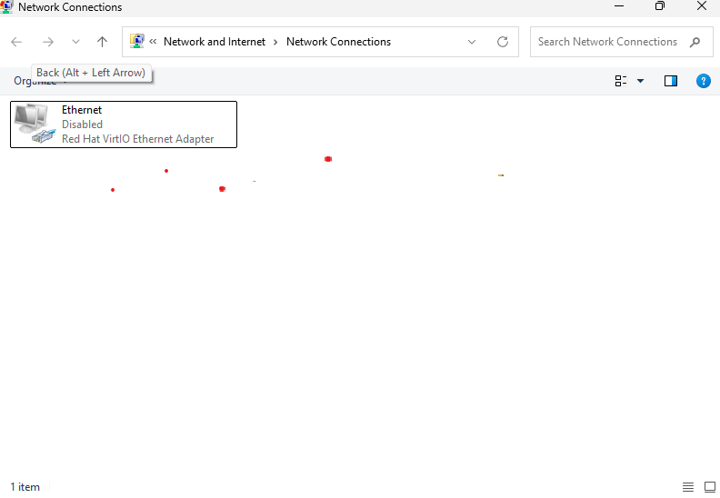
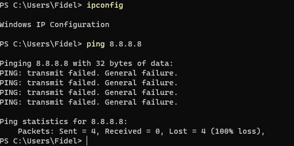
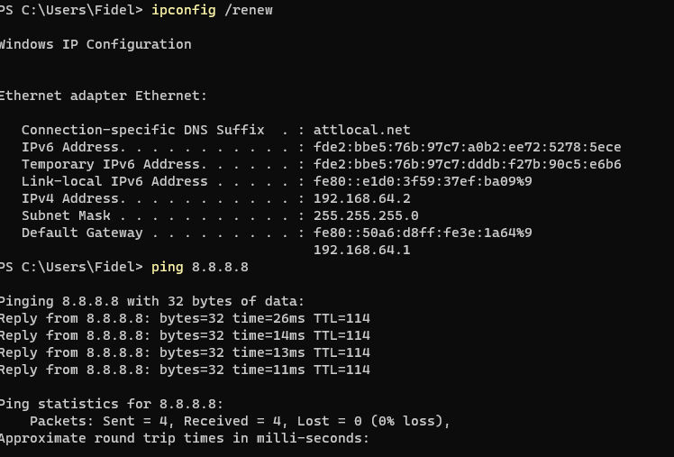
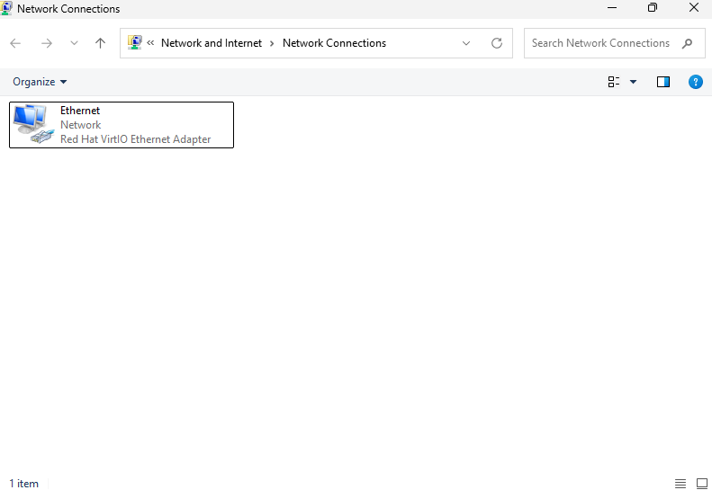
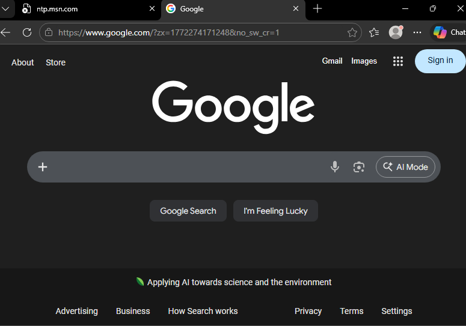

# Ticket 001 – No Internet Connectivity

## 1. Identify the Problem
User reported inability to access the internet on a Windows 11 workstation.

## 2. Environment
- Windows 11 ARM
- Running via UTM on macOS (Apple Silicon)

## 3. Initial Observations
- Browser unable to load websites
- Network adapter appeared disabled
- Ping test to 8.8.8.8 failed
## Screenshot - Adapter Disabled

## Screenshot - Failed Ping

## 4. Troubleshooting Steps Taken
- Verified network adapter status
- Executed `ipconfig` to check IP configuration
- Executed `ping 8.8.8.8` to test external connectivity
- Re-enabled network adapter
- Renewed DHCP lease using `ipconfig /renew`
- Re-tested connectivity
## Screenshot - Succesful Ping

## Screenshot - Adapter Enabled

## Screenshot - Browser Restored

## 5. Resolution
Network adapter was disabled. Re-enabling the adapter restored internet connectivity.

## 6. Verification
- Successful ping replies from 8.8.8.8
- Web browser successfully loaded google.com

## 7. Root Cause
Network adapter was manually disabled, preventing IP assignment and internet access.

## 8. Prevention
- Verify adapter status during initial troubleshooting
- Educate user on accidental adapter disabling
