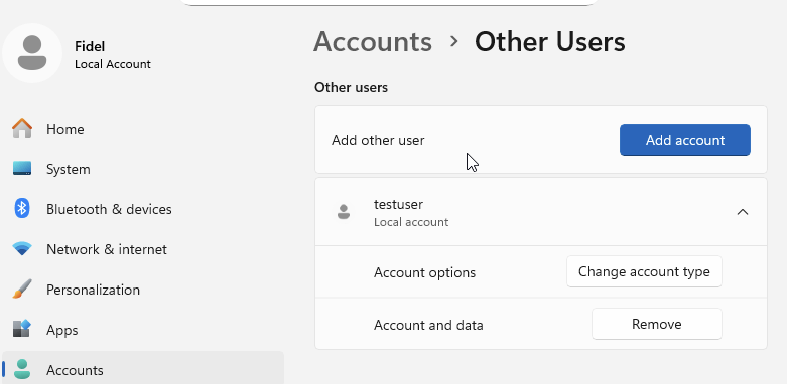
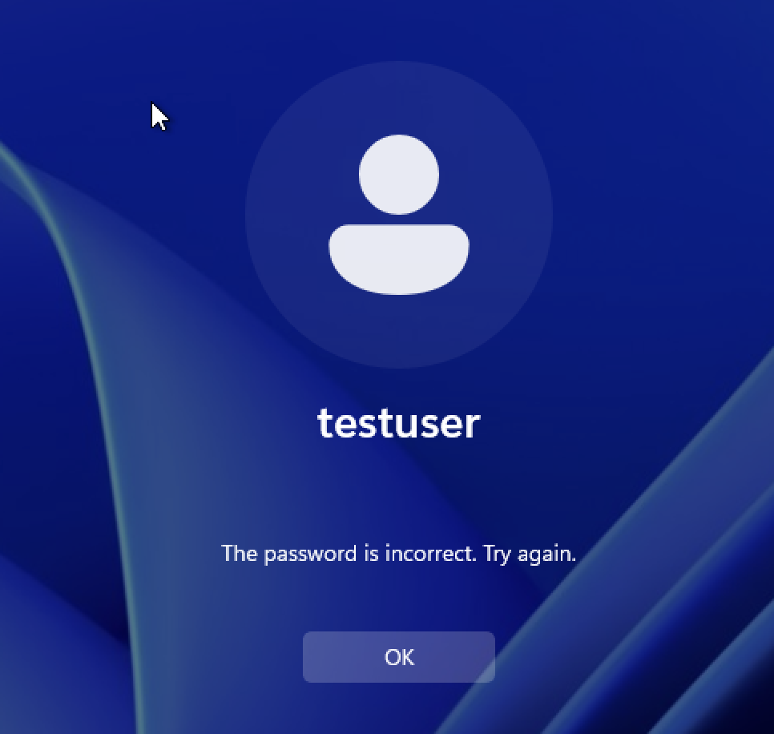
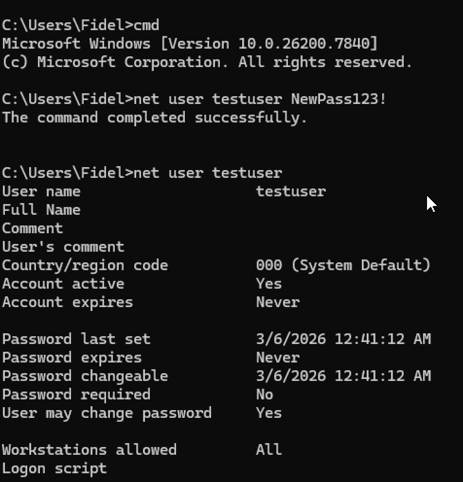
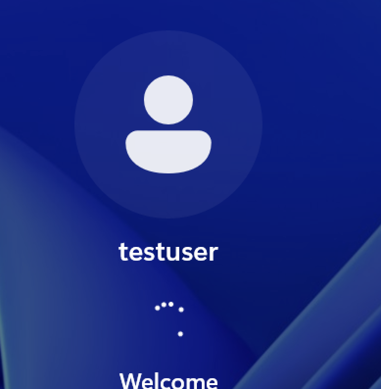

# Ticket 02 – User Login Failure

## Issue
User reported inability to log into a Windows workstation due to incorrect credentials.

## Environment
- Windows 11 Virtual Machine
- Hosted using UTM on macOS
- Local user account environment

---

## Initial Symptoms

User attempted to log into the system but received an authentication error indicating incorrect credentials.

---

## Troubleshooting Steps

1. Verified the user account existed in the system.

2. Attempted login with provided credentials to reproduce the issue.
3. Confirmed the password being used was incorrect.

4. Accessed the system using an administrator account.
5. Opened Command Prompt with administrative privileges.

7. Reset the password for the affected account.

---

## Resolution

The user password was reset through the Windows 'net user' command. After resetting the password, the user was able to login succesfully.

---

## Verification

User successfully logged into the system with the updated credentials.

Login confirmed functionality restored.

---

## Skills Demonstrated

- Windows user account management
- Authentication troubleshooting
- Password reset procedures
- End-user support workflow
