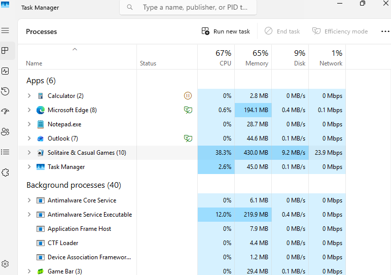
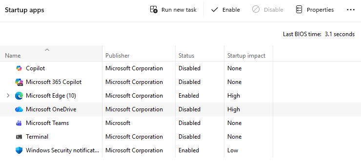
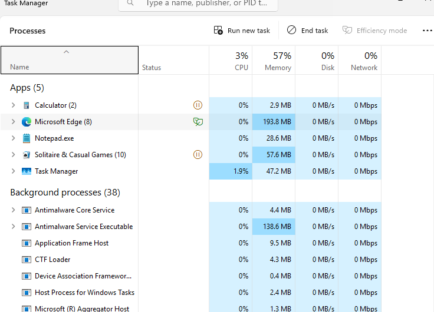

# Ticket 03 – Slow Computer Performance

## Issue
User reported that their computer was running very slowly when opening applications and performing basic tasks.

## Environment
- Windows 11 Virtual Machine
- Hosted using UTM on macOS
- Local workstation environment

---

## Initial Symptoms

- Applications opened slowly
- System responsiveness was delayed
- Multiple processes appeared to be consuming high CPU and memory resources

---

## Troubleshooting Steps

1. Opened **Task Manager** to monitor system performance.

2. Reviewed the **Processes** tab to identify applications consuming excessive system resources.

3. Observed high CPU and memory usage from multiple running applications.

4. Closed unnecessary applications and background processes to free system resources.

5. Reviewed **Startup Applications** in Task Manager to identify programs automatically launching at startup.

6. Disabled non-essential startup applications to reduce system load.

7. Restarted the system to verify improved performance.

---

## Resolution

System performance improved after closing unnecessary processes and reducing the number of applications running at startup.

---

## Verification

- CPU and memory utilization decreased to normal levels
- Applications opened and responded normally
- System performance returned to expected levels

---

## Skills Demonstrated

- Windows performance troubleshooting
- Task Manager diagnostics
- Process and resource monitoring
- Startup application management
- Basic system optimization

