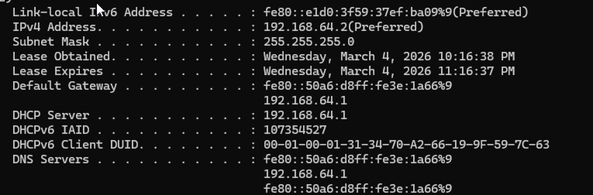

# Ticket 05 – Network Connectivity Failure

## Issue
User reported inability to access the internet from a Windows workstation.

## Environment
- Windows 11 Virtual Machine
- Hosted using UTM on macOS
- NAT network configuration

## Initial Symptoms
- Web pages failed to load
- Network connectivity appeared unavailable

## Troubleshooting Steps

1. Checked network configuration using:

ipconfig
## Screenshot-ipconfig

2. Tested external connectivity using:

ping 8.8.8.8

Result: No response received.

3. Inspected network adapter status and discovered the adapter was disabled.

4. Re-enabled the network adapter through network settings.

5. Renewed IP configuration using:

ipconfig /renew

6. Retested connectivity.

## Resolution
Network adapter had been disabled. Re-enabling the adapter restored network connectivity.

## Verification
Successful responses received when running:

ping 8.8.8.8

Web browsing functionality restored.

## Skills Demonstrated
- Network troubleshooting
- Windows adapter management
- IP configuration diagnostics
- Connectivity testing with ping
